# NITCONF - SE LAB MODULE 1 

# API DOCUMENTATION

TABLE OF CONTENTS
-------------------

* 1-AUTHENTICATION
    * 1.1 [Login](#11-login)
    * 1.2 [Register](#12-register)
* 2-PROFILE
    * 2.1 [Get current profile](#21-get-current-profile) 
    * 2.2 [Update profile](#22-update-profile) 
    * 2.3 [Get any user profile](#23-get-any-user-profile)
    * 2.4 [Verify email](#24-verify-email)
    * 2.5 [Resend email verification code](#25-resend-email-verification-code)
    * 2.6 [Request forgot password mail](#26-request-forgot-password-mail)
    * 2.7 [Update password](#27-update-password)
* 3-REVIEW
    * 3.1 [Get Reviews for Document](#31-get-reviews-for-document)
    * 3.2 [Get Review](#32-get-review)
    * 3.3 [Create Review](#33-create-review)
* 4-SESSION
    * 4.1 [Get all sessions](#41-get-all-sessions)
    * 4.2 [Create new session](#42-create-new-session)
    * 4.3 [Get session](#43-get-session)
    * 4.4 [Update session](#44-update-session)
    * 4.5 [Upload PDF](#45-upload-pdf)
    * 4.6 [Get latest PDF of session](#46-get-latest-pdf-of-session)
    * 4.7 [Update status to ACCEPTED](#47-update-status-to-accepted)
    * 4.8 [Update status to REJECTED](#48-update-status-to-rejected)
* 5-TAG
    * 5.1 [Get sessions with given tag](#51-get-sessions-with-given-tag)
    * 5.2 [Get all tags](#52-get-all-tags)
    * 5.3 [Create new tag](#53-create-new-tag)

## 1 AUTHENTICATION

### 1.1 Login
    [POST] /api/auth/login 
    To login in to the user account
    Body: { email: string, password: string }
    Response: { token: string }

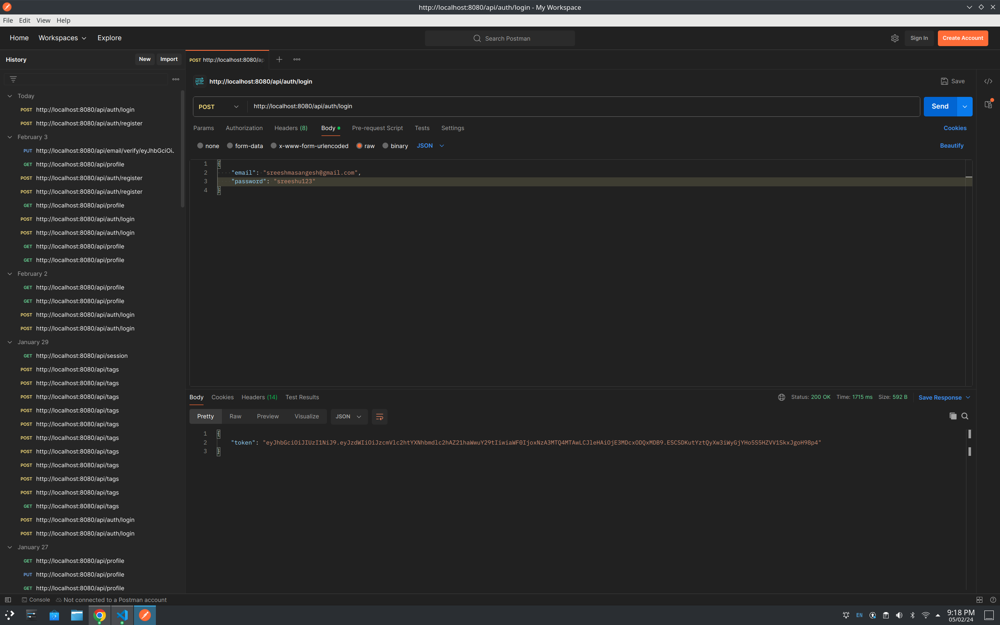

### 1.2 Register
    [POST] /api/auth/register 
    To create an account    
    Body: { firstName:string,  lastName:string, phoneNumber: string, email: string, password: string }
    Response: { token: string }

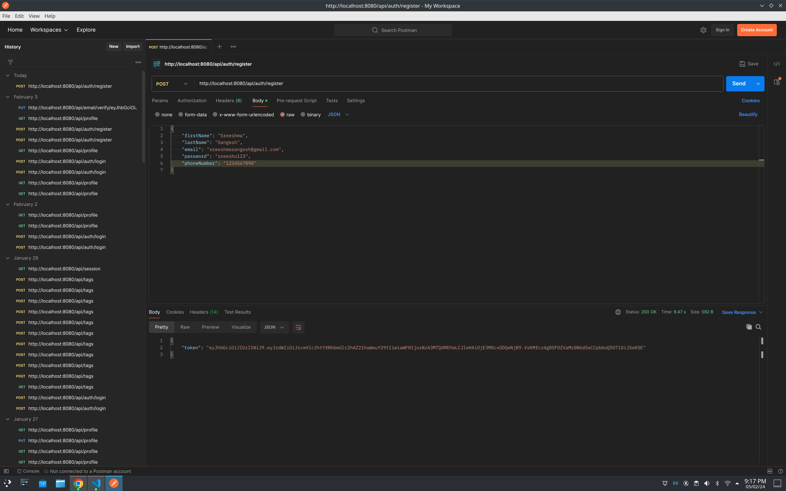

## 2 PROFILE

### 2.1 Get current profile 
    [GET] /api/profile
    To display the profile details of the current user
    Headers: { Authorization: "Bearer <token>" }
    Body: None,
    Response: {
        firstName: string,
        lastName: string,
        email: string,
        phoneNumber: string,
        role: USER
    }

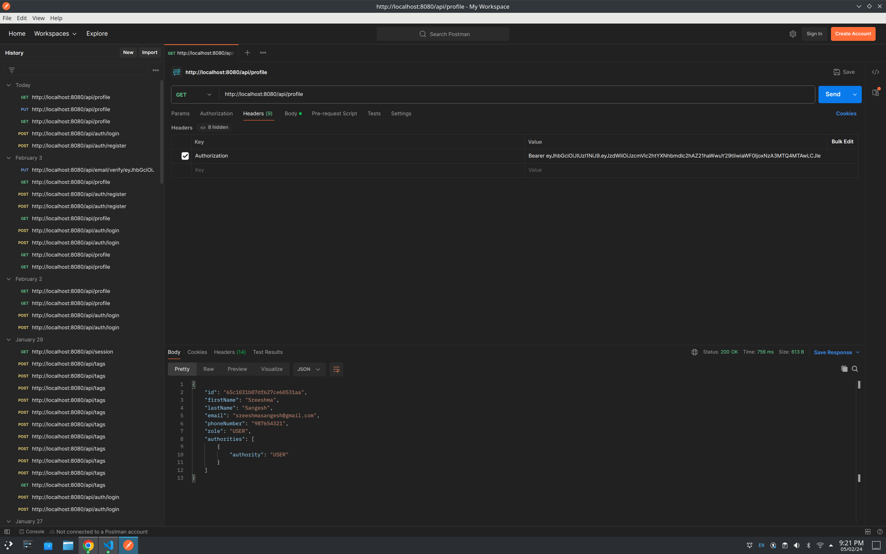

### 2.2 Update profile 
    [PUT] /api/auth/profile 
    To update the profile details of the current user
    Headers: { Authorization: "Bearer <token>" }
    Body: { 
        firstName: string,
        lastName: string,
        email: string,
        phoneNumber: string
    },
    Response: "Updated successfully"

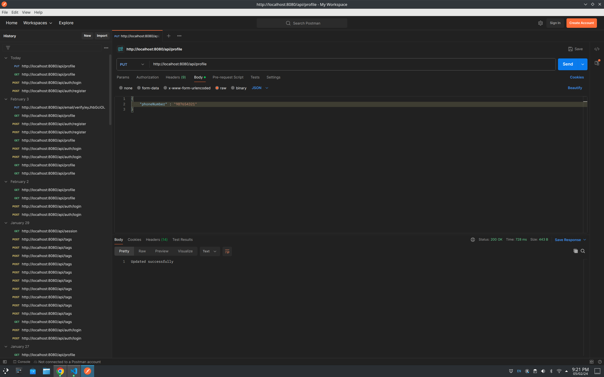

### 2.3 Get any user profile
    [GET] /api/profile/<id:string>
    To display the profile details of any user
    (Accessible only to users with Roles of either REVIEWER or PROGRAM_COMMITTEE)
    Headers: { Authorization: "Bearer <token>" }
    Body: None
    Response: {
        firstName: string,
        lastName: string,
        email: string,
        phoneNumber: string,
        role: USER
    }

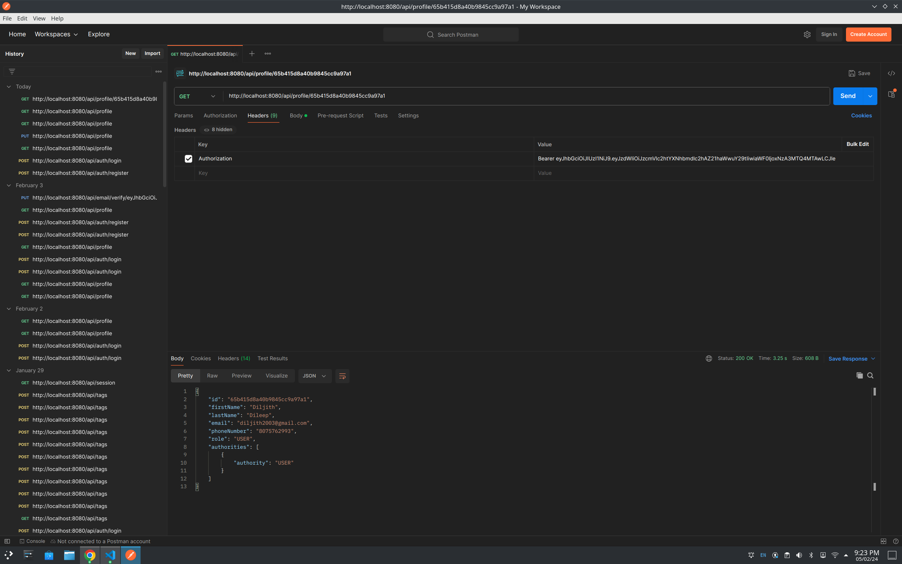

### 2.4 Verify email
    [GET] /api/email/verify/<token:string>
    To verify the email of the user
    Headers: None
    Body: None
    Response: "Email verified successfully"

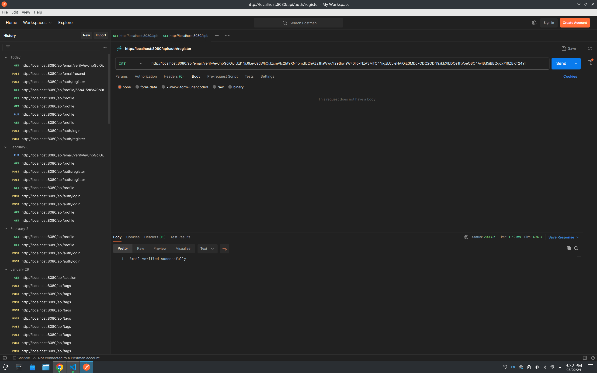

### 2.5 Resend email verification code
    [POST] /api/email/resend
    To resend email verification code to given email id
    Headers: None
    Body: { email: string }
    Response: "Email sent successfully"

### 2.6 Request forgot password mail
    [POST] /api/email/reset
    To reset password(FORGOT password)
    Headers: None
    Body: { email: string }
    Response: "Email sent successfully"

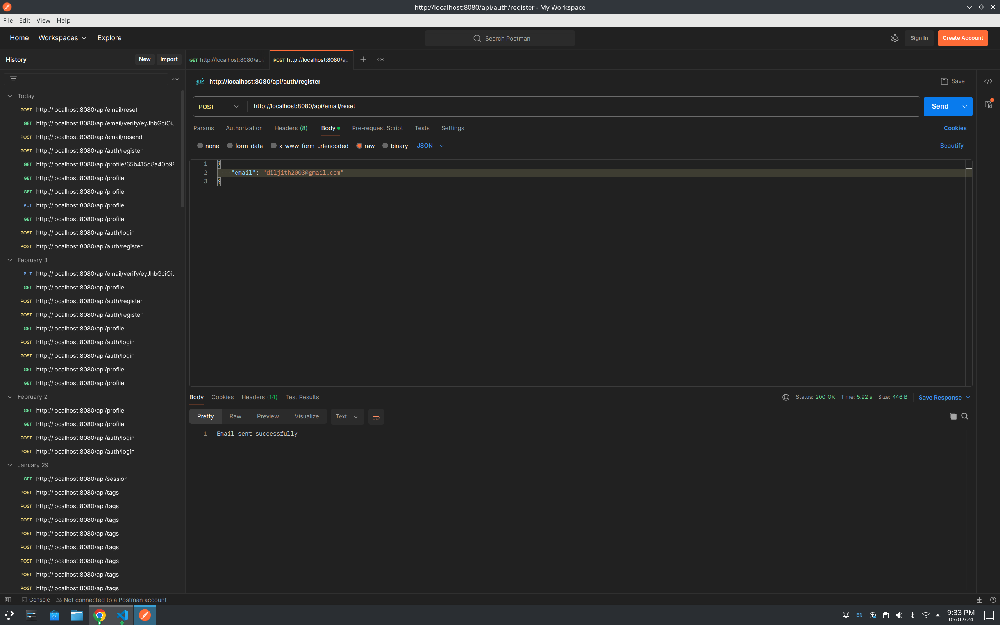

### 2.7 Update password
    [PUT] /api/email/reset/<token: string>
    To update the password
    Headers: None
    Body: { password: string }
    Response: "Password reset successfully"

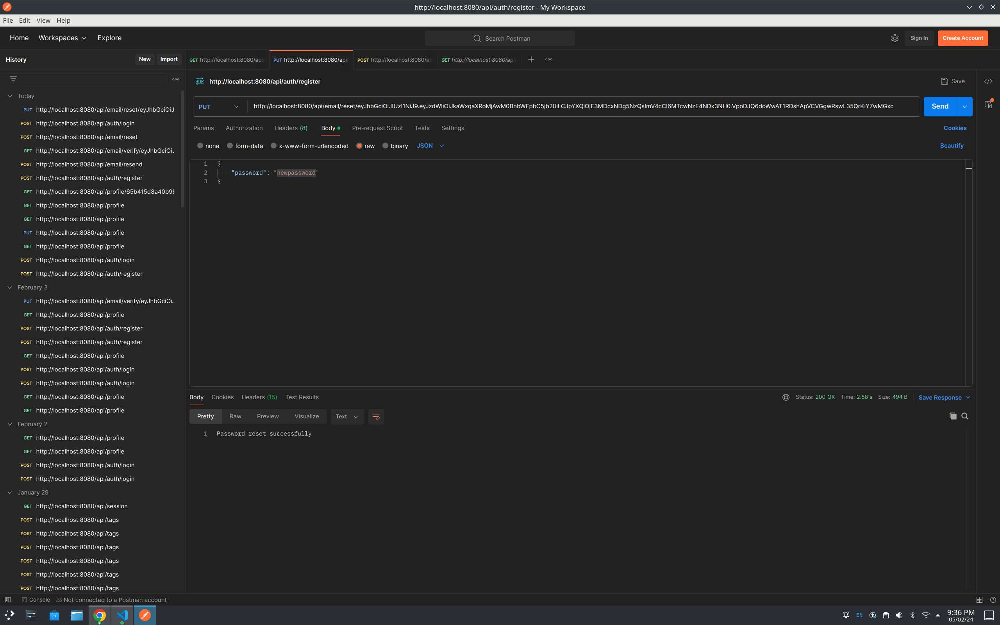

## 3 REVIEW

### 3.1 Get Reviews for Document
    [GET] /api/review/doc/<id:string>
    To obtain reviews for document with given doc id
    Headers: { Authorization: "Bearer <token>" }
    Body: { id: string }
    Response: List of {
        id: string,
        reviewer: {
            firstName: string,
            lastName: string,
            email: string,
            phoneNumber: string,
            role: REVIEWER
        },
        comment: string
    }

### 3.2 Get Review
    [GET] /api/review/<id:string>
    To obtain review with given id
    Headers: { Authorization: "Bearer <token>" }
    Body: { id: string }
    Response: {
        id: string,
        reviewer: {
            firstName: string,
            lastName: string,
            email: string,
            phoneNumber: string,
            role: REVIEWER
        },
        comment: string
    }

### 3.3 Create Review
    [POST] /api/review/<id:string>
    To create a review for ducument with given id
    Headers: { Authorization: "Bearer <token>" }
    Body: { comment: string }
    Response: "Review created"

## 4 SESSION

### 4.1 Get all sessions
    [GET] /api/session
    Returns all the sessions pertaining to the user
    Headers: { Authorization: "Bearer <token>" }
    Body: { None }
    Response: List of {
        id: string,
        title: string,
        description: string,
        language: string,
        status: PENDING | ACCEPTED | REJECTED
        date: Date,
        documentVersions: List of {
            id: string,
            changesDesc: string,
            reviews: List of {
                id: string,
                reviewer: {
                    firstName: string,
                    lastName: string,
                    email: string,
                    phoneNumber: string,
                    role: REVIEWER
                },
                comment: string
            }
        },
        tags: List of {
            id: string,
            title: string
        }
    }

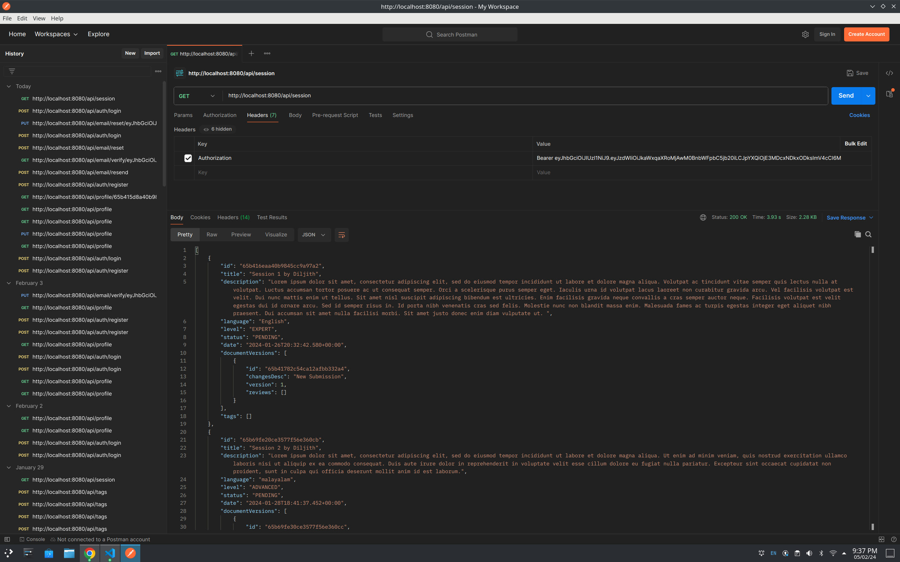

### 4.2 Create new session
    [POST] /api/session    
    Creates a new session for the user
    Headers: { Authorization: "Bearer <token>" }
    Body: { 
        title: string,
        description: string,
        language: string,
        tags: List of { tagId : string }
    }
    Response: {
        id: string,
        title: string,
        description: string,
        language: string,
        status: PENDING | ACCEPTED | REJECTED
        date: Date,
        documentVersions: List of {
            id: string,
            changesDesc: string,
            reviews: List of {
                id: string,
                reviewer: {
                    firstName: string,
                    lastName: string,
                    email: string,
                    phoneNumber: string,
                    role: REVIEWER
                },
                comment: string
            }
        },
        tags: List of {
            id: string,
            title: string
        }
    }

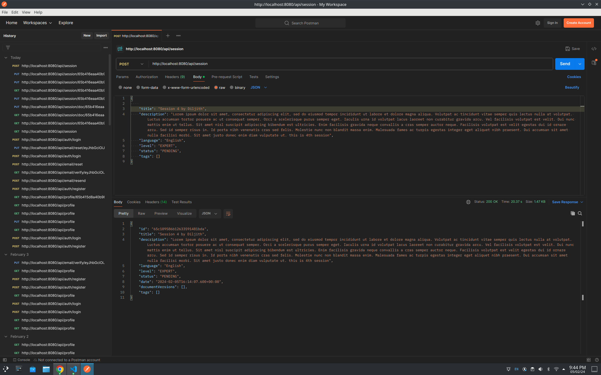

### 4.3 Get session
    [GET] /api/session/<id:string>
    Returns the session with given id
    Headers: { Authorization: "Bearer <token>" }
    Body: { None }
    Response: {
        id: string,
        title: string,
        description: string,
        language: string,
        status: PENDING | ACCEPTED | REJECTED
        date: Date,
        documentVersions: List of {
            id: string,
            changesDesc: string,
            reviews: List of {
                id: string,
                reviewer: {
                    firstName: string,
                    lastName: string,
                    email: string,
                    phoneNumber: string,
                    role: REVIEWER
                },
                comment: string
            }
        },
        tags: List of {
            id: string,
            title: string
        }
    }

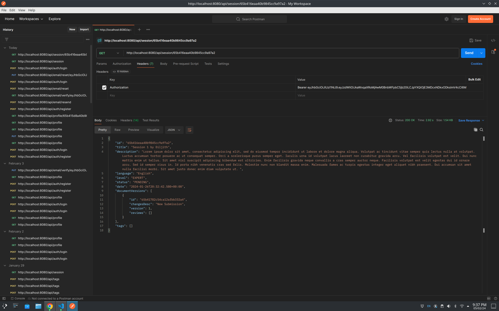

### 4.4 Update session
    [PUT] /api/session/<id:string>
    Updates the details for the session with given id 
    Headers: { Authorization: "Bearer <token>" }
    Body: { id: string, check SessionRequest.java }
    Response: {
        id: string,
        title: string,
        description: string,
        language: string,
        status: PENDING | ACCEPTED | REJECTED
        date: Date,
        documentVersions: List of {
            id: string,
            changesDesc: string,
            reviews: List of {
                id: string,
                reviewer: {
                    firstName: string,
                    lastName: string,
                    email: string,
                    phoneNumber: string,
                    role: REVIEWER
                },
                comment: string
            }
        },
        tags: List of {
            id: string,
            title: string
        }
    }

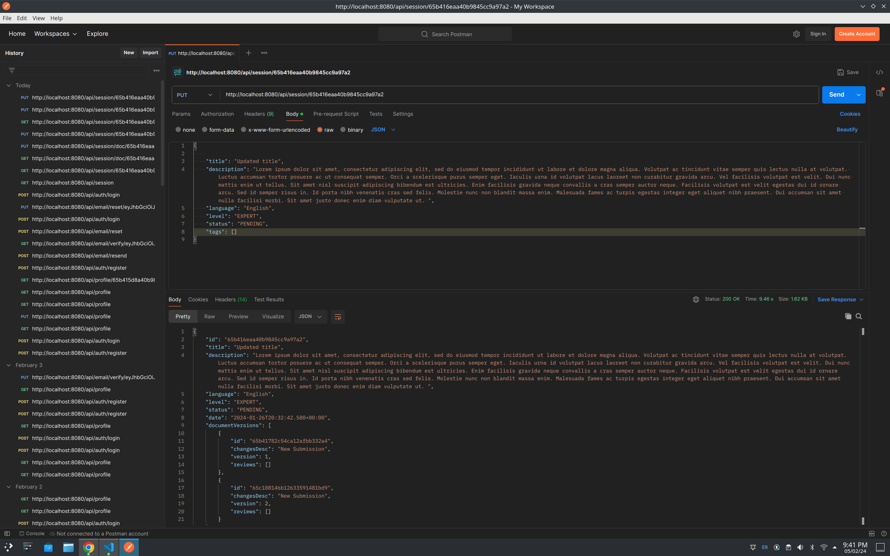

### 4.5 Upload PDF
    [PUT] /api/session/doc/<id:string>
    Uploads the PDF file to the session with given id
    Headers: { Authorization: "Bearer <token>" }
    Body: { id: string, file: PDF }
    Response: { None }

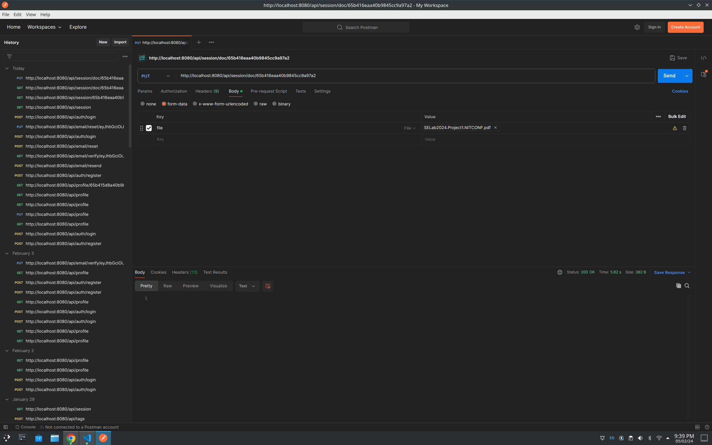

### 4.6 Get latest PDF of session
    [GET] /api/session/doc/<id:string>
    Returns the latest document of the given session id
    Headers: { Authorization: "Bearer <token>" }
    Body: { id: string }
    Response: PDF file of session id

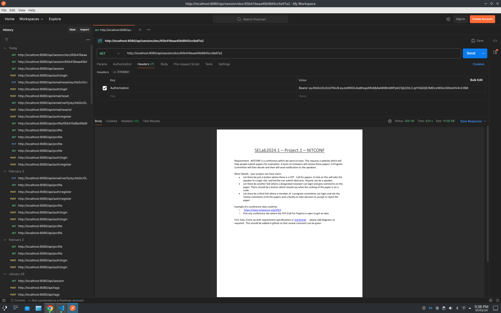

### 4.7 Update status to ACCEPTED
    [PUT] /api/session/status/accepted/<id:string>
    Sets the status of session with given id as ACCEPTED
    Headers: { Authorization: "Bearer <token>" }
    Body: { id: string }
    Response: "UPDATED STATUS TO ACCEPTED"

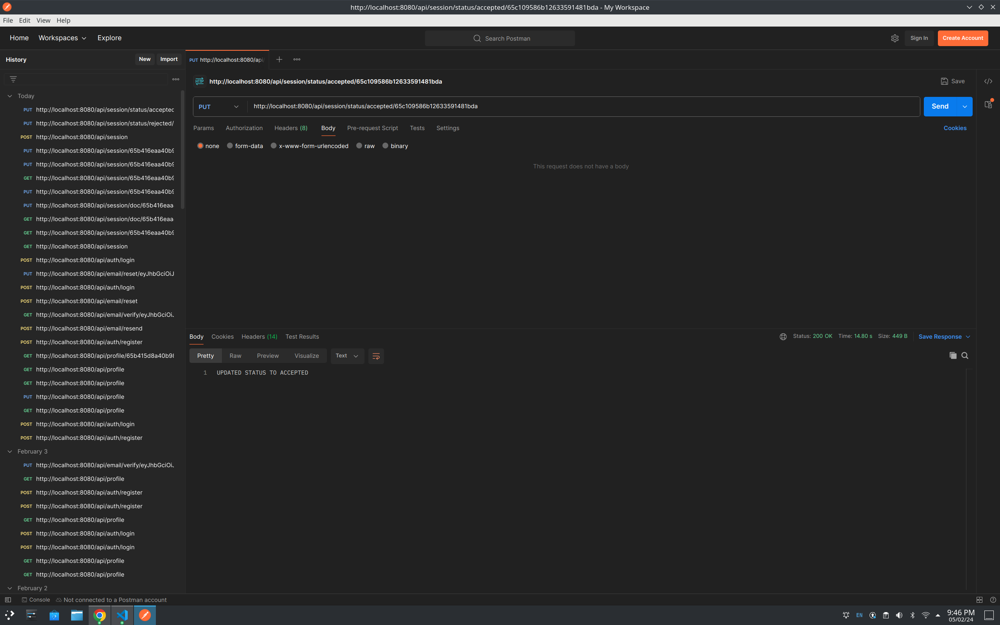

### 4.8 Update status to REJECTED
    [PUT] /api/session/doc/rejected/<id:string>
    Sets the status of session with given id as REJECTED
    Headers: { Authorization: "Bearer <token>" }
    Body: {  id: string}
    Response: "UPDATED STATUS TO REJECTED"

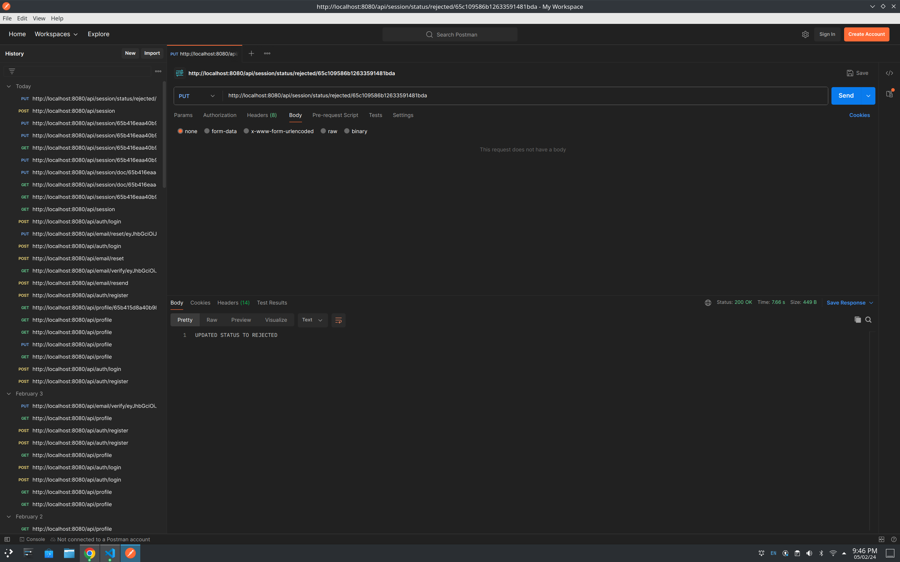

## 5 TAG

### 5.1 Get sessions with given tag
    [GET] /api/tags/<title:string>
    Returns all the sessions containing the tag with given title
    Headers: { Authorization: "Bearer <token>" }
    Body: { title: string }
    Response: List of {
        id: string,
        title: string,
        description: string,
        language: string,
        status: PENDING | ACCEPTED | REJECTED
        date: Date,
        documentVersions: List of {
            id: string,
            changesDesc: string,
            reviews: List of {
                id: string,
                reviewer: {
                    firstName: string,
                    lastName: string,
                    email: string,
                    phoneNumber: string,
                    role: REVIEWER
                },
                comment: string
            }
        },
        tags: List of {
            id: string,
            title: string
        }
    }

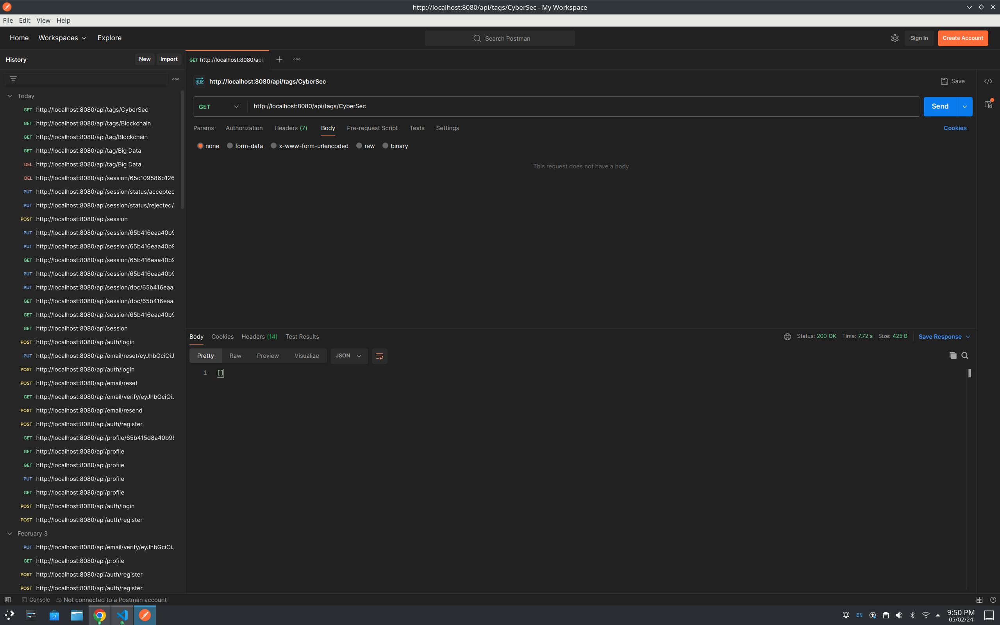

### 5.2 Get all tags
    [GET] /api/tags
    Lists all the pre-defined tags
    Headers: { Authorization: "Bearer <token>" }
    Body: { None }
    Response: List of {
        id: string,
        title: string
    }

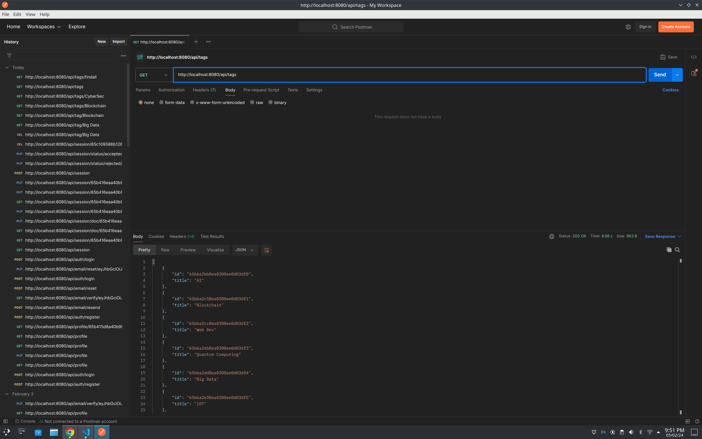

### 5.3 Create new tag
    [POST] /api/tags
    Creates the tag with the given title
    Headers: { Authorization: "Bearer <token>" }
    Body: { title: string }
    Response: { 
        id: string,
        title: string
    }

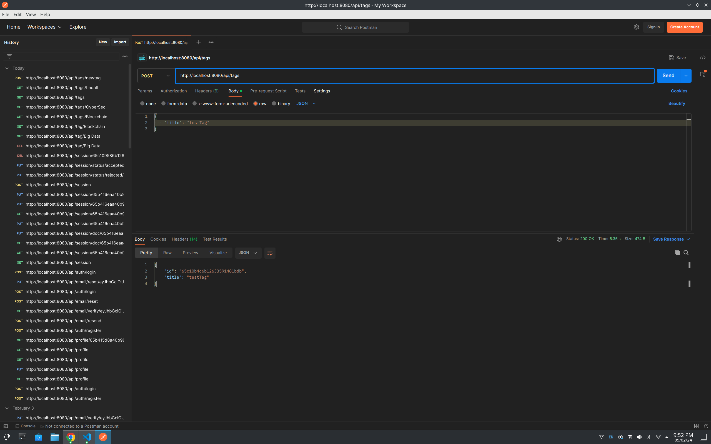

